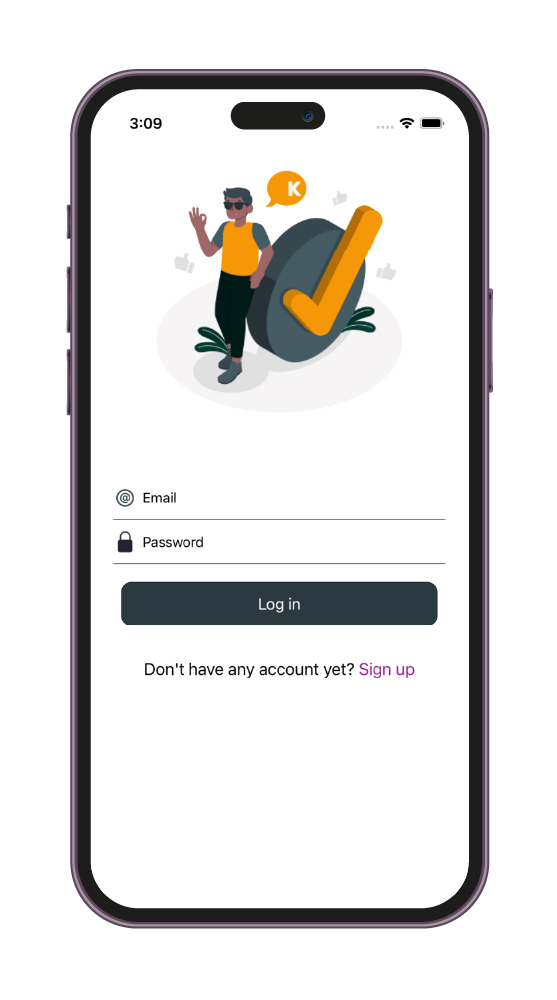

# “Diploma”

## Структура проекта

Проект разработан с соблюдением принципов **SOLID, KISS, DRY, YAGNI**. 
В проекте используется архитектура **Uber RIBs**, что обеспечивает масштабируемую и удобную структуру приложения. 
Логическая структура кода обеспечивает читаемость и улучшает поддерживаемость.

## Технологии и фреймворки

-   **Uber RIBs**
-    **UIKit**
-    **RxSwift**
-    **Firebase**
-    **CoreData**
-    **IQKeyboardManagerSwift**
-    **SwiftyUserDefaults**
-    **Auto Layout**
-    **TinyConstraints**
-    **Keychain**
-    **Face ID/Touch ID**
-    **GCD**

    
  
 
 
 
